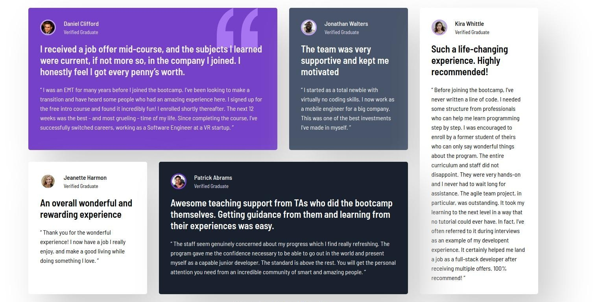

# Frontend Mentor - Testimonials grid section solution

This is a solution to the [Testimonials grid section challenge on Frontend Mentor](https://www.frontendmentor.io/challenges/testimonials-grid-section-Nnw6J7Un7). Frontend Mentor challenges help you improve your coding skills by building realistic projects. 

## Table of contents

- [Overview](#overview)
  - [The challenge](#the-challenge)
  - [Screenshot](#screenshot)
  - [Links](#links)
- [My process](#my-process)
  - [Built with](#built-with)
  - [What I learned](#what-i-learned)
  - [Continued development](#continued-development)
  - [Useful resources](#useful-resources)
- [Author](#author)
- [Acknowledgments](#acknowledgments)


## Overview

### The challenge

using CSS grid

### Screenshot




### Links

- Live Site URL: [ive site](https://omarhazem02.github.io/testimonial-page/)

## My process

### Built with

- Semantic HTML5 markup
- CSS custom properties
- Flexbox
- CSS Grid


### What I learned


To see how you can add code snippets, see below:

```html
<h1>Some HTML code I'm proud of</h1>
```
```css
.proud-of-this-css {
  color: papayawhip;
}
```

### Continued development


### Useful resources

- MDN Web Docs helped me expand my knowledge on certain topics while creating this page..
- Chat GPT and Claude supported me as  mentors by helping evaluate and review my code throughout the project.

## Author

- Website - [Omar Hazem](https://www.linkedin.com/in/omar-hazem-aa287a273/)
- Twitter - [@Omarhaz67778375](https://x.com/OmarHaz67778375)


## Acknowledgments

I would like to acknowledge AlMadersa, where I am currently studying in the Front-End Development Diploma program. Special thanks to my course tutor, Mohamed Abu Sarea (محمد أبو سريع), for his valuable guidance and support.
